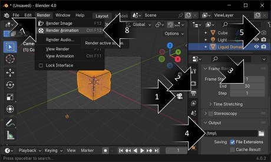
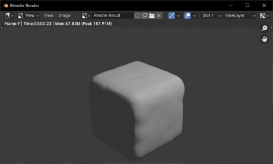
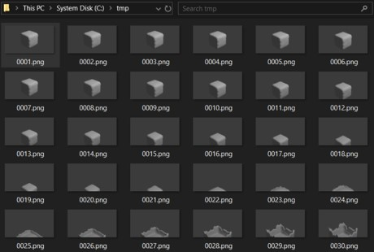
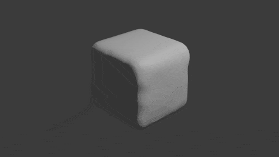

# [atet](https://github.com/atet) / [**_blender_**](https://github.com/atet/blender/blob/main/README.md#atet--blender)

# Introduction to Blender

These instructions will get you familiar with Blender by quickly creating a liquid simulation of a three-dimensional model and exporting an animation.

Excluding time to download and processing your animation, _**you will be able to complete this tutorial in ~10 minutes**_

--------------------------------------------------------------------------------------------------

## Table of Contents

### Introduction

* [0. Preface](#0-preface)
* [1. Requirements](#1-requirements)
* [2. Installation](#2-installation)
* [3. Basic Navigation](#3-basic-navigation)
* [4. Applying Physics](#4-applying-physics)
* [5. Recording Animation](#5-recording-animation)
* [6. Next Steps](#6-next-steps)

### Supplemental

* [Other Resources](#other-resources)
* [Troubleshooting](#troubleshooting)

--------------------------------------------------------------------------------------------------

## 0. Preface

Blender is a popular free and open-source software used for 3D computer graphics. This powerful tool can produce 3D simulations, animations, artwork, 3D printing models, and many other creations like the `.gif` of a melting chocolate bar below:

Because Blender is extremely multifunctional, it can be complex given its many features. **To focus our efforts in this tutorial, we will quickly create a simple animation** that would be difficult to generate elsewhere.

[Back to Top](#table-of-contents)

--------------------------------------------------------------------------------------------------

## 1. Requirements

Any computer made in the past decade should be able to run Blender for our tutorial animation.

Blender is available for Windows, MacOS, and Linux; this tutorial uses Windows 10, but most commands should be the same between different operating systems.

[Back to Top](#table-of-contents)

--------------------------------------------------------------------------------------------------

## 2. Installation

Download Blender for you operating system at: https://www.blender.org/download/

This tutorial uses the "**portable**" Windows version of Blender to simplify installation (portable means that the software just needs to be extracted and does not need to be installed on your system).

[Back to Top](#table-of-contents)

--------------------------------------------------------------------------------------------------

## 3. Basic Navigation

When you first start Blender, you will be presented with a default file that has a 3D cube in it. For the purposes of this tutorial, you do not need to manipulate the `Cube` object other than selecting it by clicking on it (it will be highlighed in an orange outline when selected).

[Back to Top](#table-of-contents)

--------------------------------------------------------------------------------------------------

## 4. Applying Physics

With the `Cube` selected, go to the `Object` menu (1) and scroll down to select `Quick Effects` (2) and choose `Quick Liquid` (3).

This will create a new object called `Liquid Domain`, it is represented by the larger orange rectangular outline around the cube.

Reselect the `Cube` (1) and choose the `Physics Properties` (1) and scroll down to `Fluid` menu (3). Change `Type` to `Flow`, `Flow Type` to `Liquid`, and `Flow Behavior` to `Geometry`.

Reselect the `Liquid Domain` (1), select `Material Properties` (2), delete the default material (3), create a `New` material (4), and leave as the default new material `Material.001` (5).

Select the `Physics Properties` for `Liquid Domain` (1) and under `Fluid`, select `Mesh`.

Continue to scroll past the `Fluid` submenu and under `Cache`, change `End` to `30` (1), change `Type` to `All` (2), and click on `Bake All`. Blender will now simulate 30 frames of the liquid simulation on the `Cube`.

After a few moments, Blender will have finished processing and we can move forward to recording an animation of the physics simulation.

[Back to Top](#table-of-contents)

--------------------------------------------------------------------------------------------------

## 5. Recording Animation

Select the `Toggle Camera View` (1) so you can see the recording camera's perspective. With the `Liquid Domain` object selected, go to `Output Properties` (2) and change `End` to `30` (3) and you can change the output path if you want (4). For the `Cube` object, click on `Disable in Renders` (5) so it is greyed out. Under the `Render` menu (7), select `Render Animation`.

A new window will pop up and Blender will start rendering the animation. Note that this is a separate step from the "baking" physics simulation and is what is required to produce the final files used for animation.

After a few moments, you will have each of the 30 frames rendered as separate images in your designated output folder.

With these individual frames, you can use other software like GIMP or ScreenToGif to create a `.gif` animation or even `.mp4` video file!

[Back to Top](#table-of-contents)

--------------------------------------------------------------------------------------------------

## 6. Next Steps

***Congratulations, you've created your first computer-generated imagery (CGI) just like in the movies!*** 

If you're wondering how to make the melting chocolate bar like in the Preface section, you'll have to look into these concepts:

- **Using different models**: `File` → `Import` (See ["Free 3D Models"](#other-resources))
- **Backgrounds**: `World` → `Color` → `Environment Texture` (See ["Free HDRI Backgrounds"](#other-resources))
- **Manipulating camera**: In `Camera View`, pan, move, and zoom to the perfect angle for recording
- **Surface colors and appearances**: Revisit `Material Properties` from the [Applying Physics](#4-applying-physics) step and look into properties like `Base Color`, `Metallic`, `Roughness`, etc.
- **Changing properties during animation**: Change `Material Properties` and utilize [Keyframes](https://docs.blender.org/manual/en/latest/animation/keyframes/index.html) throughout the rendering (e.g., surface becomes more mirror polished and color turns lighter)

[Back to Top](#table-of-contents)

--------------------------------------------------------------------------------------------------

## Other Resources

**Description** | **URL Link**
--- | ---
GIMP (GNU Image Manipulation Program) | https://www.gimp.org/
ScreenToGif | https://www.screentogif.com/
Free 3D Models | https://www.thingiverse.com/
Free HDRI Backgrounds | https://polyhaven.com/

[Back to Top](#table-of-contents)

--------------------------------------------------------------------------------------------------

## Troubleshooting

Issue | Solution
--- | ---
**"It's not working!"** | This concise tutorial has distilled hours of sweat, tears, and troubleshooting; _it can't not work_

[Back to Top](#table-of-contents)

--------------------------------------------------------------------------------------------------

Copyright © 2024-∞ Athit Kao, <a href="http://www.athitkao.com/tos.html" target="_blank">Terms and Conditions</a>

